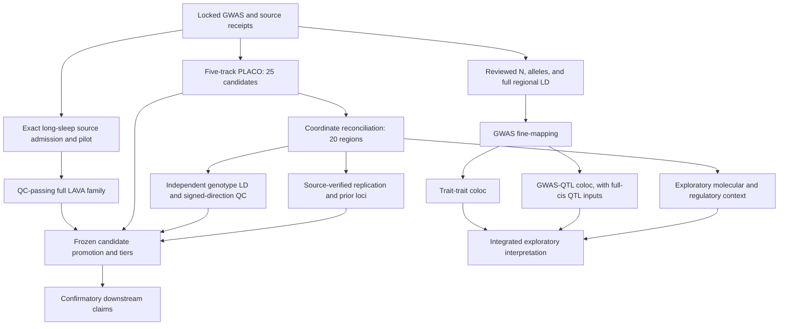

# Brain6 remaining-work dependency graph

This is a current-state audit of the 25 frozen pair-specific PLACO candidates and their 20 geographic groups. It reuses the source-bound five-track [v6 region evidence](../exploratory_five_track_v6/region_evidence_report.md), [method-readiness audit](../exploratory_five_track_v3/method_readiness_20260927.md), [long-sleep source rescue](../lava_longsleep_source_rescue_v1/BRAIN6_CONFIRMATORY_STATUS.md), and frozen [evidence-tier rule](../../config/shared_locus_evidence_tiers_v1.json). It does not amend their protocols or results.

The classes below follow the requested A/B/C distinction. **B with `METHOD_INPUT_MISSING` is an exploratory method in principle, but is not executable honestly today**; LAVA passing alone would not supply its missing input. This separate readiness flag avoids misclassifying a methodological limitation as a LAVA failure.

| Component | Class | Current readiness | Authoritative evidence / next action |
|---|:---:|---|---|
| Five-track candidate identity and 25-to-20 geography | A | COMPLETE | Frozen PLACO candidate provenance and geographic membership; join exactly, never deduplicate the 25 pair rows into 20 claims. |
| Independent genotype LD, signed directions, and explicit QC exceptions | A | COMPLETE_WITH_EXCEPTIONS | v6 reconciles candidate and lead genotypes; six candidate raw signed correlations remain out of range and 24 lack exact frozen-reference allele. Preserve exceptions, do not repair by clipping. |
| Source and cohort-overlap classification; pair-level replication | A | COMPLETE_WITH_LIMITS | Existing six-pair replication master is global. No locus-specific independent two-trait replication established. |
| Published-locus/gene context | A | COMPLETE_DESCRIPTIVE | Official Catalog and positional-gene tables exist; current bounded package must keep source study, trait, coordinates, and UKB overlap visible. |
| Long-sleep ≥10 h UKB+MVP exact-variant lookup | B | COMPLETE_EXPLORATORY | 20/26 leads available in all 20 regions; UKB overlap and cutoff mismatch preclude independent confirmation. |
| Published GTEx brain credible-set intersection | B | COMPLETE_DESCRIPTIVE | Published molecular eQTL/sQTL PIP and candidate membership are available; they are **not GWAS PIP or coloc**. |
| Exact-lead eQTL and Ensembl regulatory coordinate annotation | B | COMPLETE_DESCRIPTIVE | Nominal lead query and six regulatory feature overlaps across five exact leads are cached; no causal-gene inference. |
| Tissue and cell-type description | B | RUNNABLE_DESCRIPTIVE | Summarize only explicitly named source tissues and gene/feature records; no enrichment or causal tissue ranking from nearest genes. |
| Pathway enrichment | B | METHOD_INPUT_MISSING | No reviewed locus-to-gene weights, universe, pathway collection, or multiplicity family. Publish an explicit not-estimable table rather than a nearest-gene enrichment. |
| GWAS SuSiE fine-mapping | B | METHOD_INPUT_MISSING | No reviewed trait-specific N/case-fraction representation, full regional allele-aligned signed LD matrix, or pinned susieR; source cards alone do not validate these. Do not report GWAS PIP. |
| Trait-trait colocalization | B | METHOD_INPUT_MISSING | Requires two valid dense regional datasets, sample-size/prior/overlap contract; multi-signal mode also needs sound fine-mapping. No PP.H4 can be computed honestly now. |
| Actual GWAS-eQTL/sQTL colocalization | B | METHOD_INPUT_MISSING | Published credible sets and nominal lead rows are insufficient; source-verified full-cis QTL summary data, allele/build harmonization, effective N and priors are absent. |
| SleepChart variant-level replication | B | ACCESS_MISSING | Official portal points to Synapse file `syn70524096`; anonymous download returned HTTP 403. No variant-level result should be imputed. |
| Source-admitted exact Dashti input and prospective pilot | C | EXTERNAL_LONG_SLEEP_SOURCE_BLOCK | Requires original model and variant N/NMISS; no more arbitrary N/case-fraction arms. This precedes any full-family attempt. |
| Full 12,475-slot bivariate LAVA family and frozen ≤873 NOT_RUN gate | C | BLOCKED_LAVA | Canonical seven-trait univariate family has 3,720 NOT_RUN; no full rerun until a source-valid route projects passing. |
| Candidate promotion, final tiers, and confirmatory cross-layer claims | C | BLOCKED_LAVA | Frozen rule requires complete qualifying LAVA and exact upstream evidence. All 25 remain unpromoted. |

Execution order now: verify reuse of completed A/B artifacts → integrate complete 20/25 and replication/annotation tables → make per-region method-readiness decisions → write bounded manuscript claims and provenance → freeze a single guarded rescue workflow. When source information arrives: source admission → harmonization → 88-locus pilot → family projection and trait repairs → full LAVA → frozen gate → candidate promotion → confirmatory downstream work → regenerate tables.
